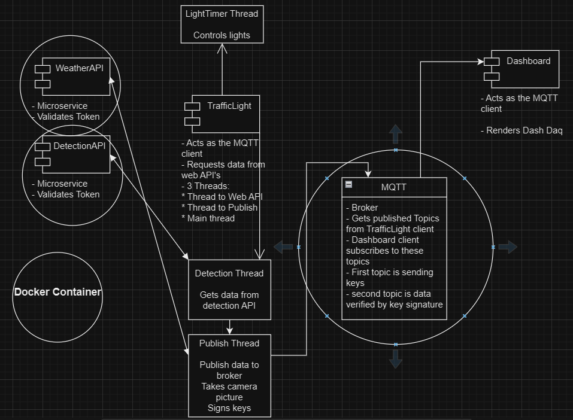

# TrafficLight-Project

> https://gitlab.com/elissarf/trafficlight-project

This program simulates traffic light nodes accross a city,
capturing motion or collisions on red lights, publishing the 
information gathered, through MQTT broker, to a daq dashboard.
Ensures security all through out, by authorization with JWT tokens and signing and verifiying asymetric keys.

## Showcase
### Initial design

### Updated design

## Design
- Threads are used to run multiple tasks simultaneously, such as: LightTimer, Main thread of the TrafficLight client and the Detection thread inside of TrafficLight, that requests data from the DetectionApi, and creates a new thread to publish the data on Publisher.py

- Microservices are containerized; WeatherAPI and DetectionAPI and MQTT broker
- Implements security, checks for token expiration on web API's and verifies key signatures between clients
- Need to generate key pair once by running GenerateKeys.py
- Utilizes raspberry pi camera to take pictures

## Features
- Simulates traffic light.
- Requests data from WEB API'S.
- Publishes data through MQTT broker.
- Subscribes to broker to display data on dashboard.
- Handles JWT token and key signatures for security.

## Prerequisites

### Setup
1.  > sudo docker compose up -d
2. > cd trafficLight
3. > python GenerateKeys.py
4. Modify Dashboard.py broker_hostname to connect to server that MQTT is running on

### Run
1. > python Dashboard.py
2. > cd trafficLight
3. > python TrafficLight.py 

(need to be in same folder where keys are recognised)

## Contributors
- Elissar Fadel
- Dan Moraru
